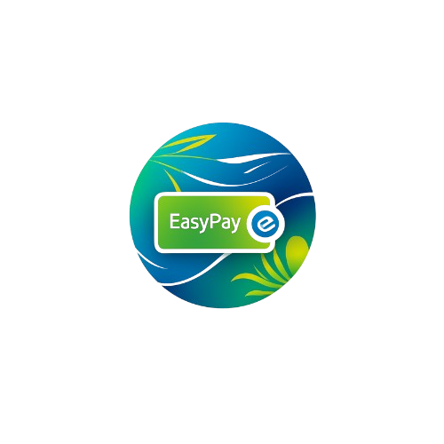

# EasyPay - E-Wallet Application

<div align="center">
  

  <p align="center">
    A modern and secure digital wallet application built with Flutter
    <br />
    <a href="#features"><strong>Explore Features »</strong></a>
    <br />
    <br />
    <a href="#getting-started">Getting Started</a>
    ·
    <a href="#documentation">Documentation</a>
    ·
    <a href="#screenshots">Screenshots</a>
  </p>
</div>

## 📱 About The Project

**EasyPay** is a comprehensive digital wallet application that enables users to manage their finances seamlessly. Built with Flutter and following clean architecture principles, the app provides a secure, intuitive, and modern experience for daily financial transactions.

### Key Highlights

- 🎨 **Modern UI/UX** - Clean and intuitive interface with light theme design
- 🔐 **Secure Transactions** - PIN verification for all sensitive operations
- 💳 **Multiple Services** - Top-up, transfer, data packages, and more
- 📊 **Real-time Balance** - Live balance updates and transaction history
- 🏦 **Multiple Payment Methods** - Support for various banks (BCA, BNI, Mandiri)
- 📱 **Responsive Design** - Optimized for various screen sizes

---

## ✨ Features

### Authentication & Security
- ✅ User registration with email verification
- ✅ Secure login system
- ✅ Profile picture upload with KYC support
- ✅ PIN-based transaction verification
- ✅ Secure token-based authentication
- ✅ PIN validation with shake animation on error

### Financial Operations
- 💰 **Wallet Top-Up**
  - Multiple payment methods (BCA, BNI, Mandiri)
  - Integration with Midtrans payment gateway
  - Real-time balance updates
  - Custom amount input with number pad

- 💸 **Money Transfer**
  - Transfer to other users by username
  - Recent transfer contacts
  - Amount validation
  - Transaction confirmation with PIN

- 📱 **Data Package Purchase**
  - Multiple operator support (Telkomsel, Indosat, XL, etc.)
  - Various data package options
  - Phone number validation
  - Package selection with visual feedback

### User Experience
- 🏠 **Home Dashboard**
  - Wallet card with balance display
  - Quick access to services
  - Latest transactions
  - Friendly financial tips
  - Send again feature

- 👤 **Profile Management**
  - View and edit profile information
  - Profile picture management
  - Account settings
  - Logout functionality

- 📜 **Transaction History**
  - Comprehensive transaction list
  - Transaction details
  - Filter and search capabilities

- 🎁 **Additional Features**
  - Statistics page (coming soon)
  - Rewards program (coming soon)
  - In-app web view for tips
  - Bottom navigation for easy access

---

## 🛠️ Tech Stack

### Frontend
- **Flutter** (v3.5.0+) - Cross-platform mobile framework
- **Dart** (v3.5.0+) - Programming language

### State Management & Architecture
- **flutter_bloc** (v8.1.6) - BLoC pattern implementation
- **equatable** (v2.0.7) - Value equality for Dart objects

### UI & Design
- **google_fonts** (v6.2.1) - Poppins font family
- **carousel_slider** (v5.0.0) - Image carousels
- **flutter_inappwebview** (v6.0.0) - In-app web browsing

### Storage & Security
- **flutter_secure_storage** (v9.2.2) - Secure token storage
- **image_picker** (v1.1.2) - Profile picture selection

### Networking & APIs
- **http** (v1.2.2) - REST API communication
- **url_launcher** (v6.3.1) - External URL handling

### Utilities
- **intl** (v0.20.0) - Internationalization and formatting
- **another_flushbar** (v1.12.30) - Custom snackbar notifications

---

## 🏗️ Project Architecture

The project follows **Clean Architecture** principles with **BLoC pattern** for state management:

```
lib/
├── blocs/               # Business Logic Components
│   ├── auth/           # Authentication logic
│   ├── user/           # User management
│   ├── topup/          # Top-up operations
│   ├── transfer/       # Transfer operations
│   ├── data_plan/      # Data package logic
│   ├── payment_method/ # Payment method handling
│   ├── operator_card/  # Operator card logic
│   └── tip/            # Tips management
│
├── models/             # Data models
│   ├── user_model.dart
│   ├── transaction_model.dart
│   ├── topup_form_model.dart
│   ├── transfer_form_model.dart
│   ├── data_plan_model.dart
│   └── ...
│
├── services/           # API Services
│   ├── auth_service.dart
│   ├── user_service.dart
│   ├── transaction_service.dart
│   ├── topup_service.dart
│   └── ...
│
├── ui/                 # User Interface
│   ├── pages/         # Screen pages
│   │   ├── splash_page.dart
│   │   ├── onboarding_page.dart
│   │   ├── home_page.dart
│   │   ├── pin_page.dart
│   │   └── ...
│   └── widgets/       # Reusable widgets
│       ├── buttons.dart
│       ├── form.dart
│       ├── package_item.dart
│       └── ...
│
└── shared/            # Shared resources
    ├── theme.dart     # App theme & colors
    ├── shared_method.dart
    └── shared_values.dart
```

### BLoC Pattern Flow

```
UI Layer (Widgets)
    ↓ dispatch events
BLoC Layer (Business Logic)
    ↓ call methods
Service Layer (API)
    ↓ return data
Model Layer (Data)
    ↓ emit states
UI Layer (Rebuild)
```

---

## 🚀 Getting Started

### Prerequisites

- **Flutter SDK** (v3.5.0 or higher)
- **Dart SDK** (v3.5.0 or higher)
- **Android Studio** / **VS Code** with Flutter extensions
- **Android SDK** (for Android development)
- **Xcode** (for iOS development on macOS)

### Installation

1. **Clone the repository**
   ```bash
   git clone https://github.com/yourusername/e_wallet.git
   cd e_wallet
   ```

2. **Install dependencies**
   ```bash
   flutter pub get
   ```

3. **Configure API Base URL**

   Update the base URL in `lib/shared/shared_values.dart`:
   ```dart
   String baseUrl = 'https://your-api-url.com/api';
   ```

4. **Run the app**
   ```bash
   # For Android
   flutter run

   # For iOS (macOS only)
   flutter run -d ios

   # For specific device
   flutter run -d device_id
   ```

### Build APK (Android)

```bash
# Debug APK
flutter build apk --debug

# Release APK
flutter build apk --release

# Split APK by ABI (smaller file size)
flutter build apk --split-per-abi
```

### Build App Bundle (Android)

```bash
flutter build appbundle --release
```

---

## 📖 Documentation

### API Integration

The app communicates with a RESTful API backend. Configure your API endpoints in:

**File:** `lib/shared/shared_values.dart`

```dart
String baseUrl = 'https://api.yourserver.com/api';
```

### Authentication Flow

1. User registers with email and password
2. Upload KYP (Know Your Profile) image
3. Set 6-digit PIN
4. Login with email and password
5. Token stored securely using flutter_secure_storage
6. Token sent with every API request in Authorization header

### Key Endpoints

```
POST   /register          - User registration
POST   /login             - User login
POST   /topups            - Create top-up transaction
POST   /transfers         - Transfer money
POST   /data_plans        - Purchase data package
GET    /payment_methods   - Get available payment methods
GET    /operator_cards    - Get operator card list
GET    /tips              - Get financial tips
```

### Environment Setup

Create a `.env` file in the root directory (optional):

```env
API_BASE_URL=https://your-api-url.com/api
MIDTRANS_CLIENT_KEY=your-midtrans-client-key
```

---

## 🎨 Theme & Design

### Color Scheme

- **Primary Color:** `#7ebc29` (Green) - Used for accents, buttons, and highlights
- **Background Colors:**
  - Light: `#F6F8FB` - Main background
  - Dark: `#020518` - Alternative background
  - White: `#FFFFFF` - Cards and containers
- **Text Colors:**
  - Black: `#14193F` - Primary text
  - Grey: `#A4A8AE` - Secondary text
  - Red: `#FF2566` - Error states
  - Green: `#1ABC9C` - Success states

### Typography

- **Font Family:** Poppins (Google Fonts)
- **Weights:** Regular (400), Medium (500), SemiBold (600), Bold (700)

---

## 📂 Project Structure

```
e_wallet/
├── android/                 # Android native code
├── ios/                     # iOS native code
├── assets/                  # Images and static files
│   ├── img_logo_light.png
│   ├── img_logo_dark.png
│   ├── img_bg_card.png
│   ├── ic_*.png           # Service icons
│   └── img_*.png          # Bank logos
├── lib/
│   ├── blocs/             # BLoC state management
│   ├── models/            # Data models
│   ├── services/          # API services
│   ├── ui/                # User interface
│   └── shared/            # Shared resources
├── test/                  # Unit tests
├── pubspec.yaml          # Dependencies
└── README.md             # This file
```

---

## 🧪 Testing

### Run Tests

```bash
# Run all tests
flutter test

# Run with coverage
flutter test --coverage

# Run specific test file
flutter test test/widget_test.dart
```

### Test Coverage

The project includes:
- Unit tests for models and services
- Widget tests for UI components
- Integration tests for complete flows

---

## 🔧 Configuration

### Android Configuration

**Minimum SDK:** 21 (Android 5.0 Lollipop)
**Target SDK:** 34 (Android 14)

Update in `android/app/build.gradle`:
```gradle
android {
    compileSdk 34

    defaultConfig {
        minSdk 21
        targetSdk 34
    }
}
```

### iOS Configuration

**Minimum Deployment Target:** iOS 12.0

Update in `ios/Podfile`:
```ruby
platform :ios, '12.0'
```

### Permissions

**Android (`android/app/src/main/AndroidManifest.xml`):**
```xml
<uses-permission android:name="android.permission.INTERNET" />
<uses-permission android:name="android.permission.CAMERA" />
<uses-permission android:name="android.permission.READ_EXTERNAL_STORAGE" />
```

**iOS (`ios/Runner/Info.plist`):**
```xml
<key>NSCameraUsageDescription</key>
<string>We need camera access to upload your profile picture</string>
<key>NSPhotoLibraryUsageDescription</key>
<string>We need photo library access to select your profile picture</string>
```

---

## 📱 Screenshots

> Add your app screenshots here

### Onboarding & Auth
| Splash | Onboarding | Sign In | Sign Up |
|--------|------------|---------|---------|
|  |  |  |  |

### Main Features
| Home | Transfer | Top Up | Data Package |
|------|----------|--------|--------------|
|  |  |  |  |

### Profile & Settings
| Profile | PIN | Success | History |
|---------|-----|---------|---------|
|  |  |  |  |

---

## 🤝 Contributing

Contributions are welcome! Please follow these steps:

1. Fork the repository
2. Create your feature branch (`git checkout -b feature/AmazingFeature`)
3. Commit your changes (`git commit -m 'Add some AmazingFeature'`)
4. Push to the branch (`git push origin feature/AmazingFeature`)
5. Open a Pull Request

### Code Style

- Follow [Effective Dart](https://dart.dev/guides/language/effective-dart) guidelines
- Use meaningful variable and function names
- Add comments for complex logic
- Write tests for new features

---

## 📝 Changelog

### Version 1.0.0 (Current)
- ✅ Initial release
- ✅ Complete authentication flow
- ✅ Wallet top-up with Midtrans integration
- ✅ Money transfer between users
- ✅ Data package purchase
- ✅ Profile management
- ✅ Modern UI with light theme
- ✅ PIN verification system
- ✅ Transaction history

### Upcoming Features
- 📊 Statistics dashboard
- 🎁 Rewards and cashback program
- 🔔 Push notifications
- 📈 Spending analytics
- 💱 Currency exchange
- 🎫 Bill payments
- 📧 Email transaction receipts

---

## 🐛 Known Issues

- None reported yet

---

## 💡 FAQ

**Q: How do I reset my PIN?**
A: Currently, PIN reset is not implemented. Contact support for assistance.

**Q: Which banks are supported for top-up?**
A: BCA, BNI, and Mandiri are currently supported.

**Q: Is my data secure?**
A: Yes, all sensitive data is encrypted and tokens are stored securely using flutter_secure_storage.

**Q: Can I use this app on iOS?**
A: Yes, the app is fully compatible with both Android and iOS platforms.

---

## 📄 License

This project is licensed under the MIT License - see the [LICENSE](LICENSE) file for details.

---

## 👨‍💻 Author

**Your Name**
- GitHub: [@yourusername](https://github.com/yourusername)
- Email: your.email@example.com

---

## 🙏 Acknowledgments

- [Flutter](https://flutter.dev/) - UI framework
- [BLoC](https://bloclibrary.dev/) - State management
- [Midtrans](https://midtrans.com/) - Payment gateway
- [Google Fonts](https://fonts.google.com/) - Typography
- Build with Angga - Course platform

---

## 📞 Support

If you encounter any issues or have questions:

1. Check the [FAQ](#-faq) section
2. Search existing [Issues](https://github.com/yourusername/e_wallet/issues)
3. Create a new issue with detailed information
4. Contact support at: support@easypay.com

---

<div align="center">
  <p>Made with ❤️ using Flutter</p>
  <p>© 2025 EasyPay. All rights reserved.</p>
</div>
